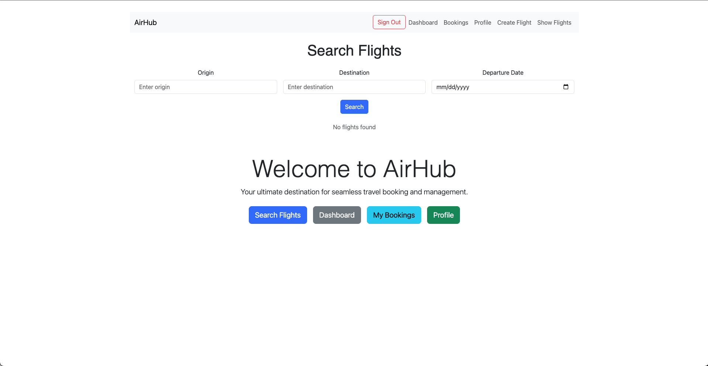

# **AirHub**

## **Screenshot/Logo**  

---

## **About AirHub**  
**AirHub** is an application designed to simplify the management of flights, bookings, and passengers. The purpose of this project is to provide an intuitive and efficient tool for airline administrators and end users to interact with a real-time flight system.

### **Key Features**  
- Administrators can add, edit, and delete flights.  
- Users can search for flights, make bookings, and manage their reservations.  
- Detailed flight information, including destinations, schedules, and prices.  

**Motivation:** Our team built this application to enhance our skills in web application development using modern technologies like React and Node.js, while practicing team collaboration.

---

## **Getting Started**  

### **Important Links**  
- **Deployed Application:** [AirHub Live App](https://airhub-us.netlify.app)  
- **Planning Materials:** [Planning Docs](https://trello.com/b/ooOv3kiE/airhub)  
- **Back-End Repository:** [AirHub Back-End Repository](https://github.com/luiscuriel-bit/airhub-back-end)

### **Attributions**  
Below are the external resources and libraries used in the development of our application:  

- **React Router:** Used for front-end routing. [Documentation](https://reactrouter.com/)  
- **Bootstrap:** CSS framework for responsive design and styling. [Documentation](https://getbootstrap.com/)  
- **FontAwesome:** Icons used in the application. [Website](https://fontawesome.com/)  
- **Mongoose:** For handling database operations in MongoDB. [Documentation](https://mongoosejs.com/)  
- **Express.js:** Web framework for the back end. [Documentation](https://expressjs.com/)  
- **Cloudinary:** For image hosting and management. [Website](https://cloudinary.com/)  

---

### **Technologies Used**  
The following technologies were utilized in the development of this project:  

#### **Front End:**  
- React.js  
- JavaScript (ES6+)  
- HTML5  
- CSS3 (with Bootstrap)  

#### **Back End:**  
- Node.js  
- Express.js  

#### **Database:**  
- MongoDB (Atlas)  
- Mongoose ORM  

#### **Version Control and Deployment:**  
- Git  
- GitHub  
- Netlify (for front end)  
- Render/Heroku (for back end deployment)  

---

### **Next Steps**  
Here are the planned future enhancements for the application:  

1. **Enhanced User Authentication:**  
   - Add improved role-based access control for admin, staff, and users.  

2. **Flight Search Optimization:**  
   - Implement advanced filtering and sorting options for users.  

3. **Notifications System:**  
   - Add email or SMS notifications for booking confirmations and flight updates.  

4. **Mobile Optimization:**  
   - Improve responsiveness and usability on mobile devices.  

5. **Analytics Dashboard (Admin):**  
   - Provide admins with flight and booking analytics for better management.  

6. **Payment Integration:**  
   - Add payment gateways like Stripe or PayPal for booking payments.  
